# DataAssist POC - AI-Powered Q&A Assistant

A sophisticated Streamlit-based application that provides intelligent Q&A capabilities using Azure OpenAI and Elasticsearch for Retrieval Augmented Generation (RAG).

## 🌟 Features

- **Interactive Q&A Interface**: Ask questions about project data and get AI-powered responses
- **RAG (Retrieval Augmented Generation)**: Combines document retrieval with large language models
- **RLHF (Reinforcement Learning from Human Feedback)**: Continuous improvement through user feedback
- **Elasticsearch Integration**: Efficient document storage and retrieval
- **Azure OpenAI Integration**: Leverages GPT models for chat completions and embeddings
- **Comprehensive Analytics**: Ragas evaluation dashboard for response quality metrics
- **Table Explorer**: Browse and analyze data tables with advanced filtering
- **Real-time Logging**: Event tracking and performance monitoring

## 🏗️ Architecture

```mermaid
graph TB
    User[👤 User] --> StreamLit[🖥️ Streamlit App]
    StreamLit --> AzureOpenAI[🧠 Azure OpenAI]
    StreamLit --> Elasticsearch[🔍 Elasticsearch]
    StreamLit --> Logging[📊 Logging & Analytics]
    
    subgraph "Azure OpenAI Services"
        AzureOpenAI --> ChatGPT[💬 Chat Completions]
        AzureOpenAI --> Embeddings[🔢 Text Embeddings]
    end
    
    subgraph "Data Layer"
        Elasticsearch --> Documents[📄 Documents]
        Elasticsearch --> TableData[📋 Table Data]
    end
    
    subgraph "Analytics"
        Logging --> Events[📝 Events]
        Logging --> Metrics[📈 Metrics]
        Logging --> Ragas[🎯 Quality Scores]
    end
```



## 🚀 Deployment Options

### Azure Container Apps (Recommended)
Deploy to Azure Container Apps using Azure Developer CLI:

```bash
# Prerequisites: Install Azure CLI and Azure Developer CLI
winget install Microsoft.AzureCLI
winget install Microsoft.Azd

# Login and deploy
az login
azd auth login
azd up
```

### Local Development
```bash
# Clone repository
git clone https://github.com/sharmadeep2/dataassist_poc.git
cd dataassist_poc

# Install dependencies
pip install -r requirements.txt

# Set up environment variables
cp .env.template .env
# Edit .env with your Azure OpenAI and Elasticsearch configuration

# Run application
streamlit run app.py
```

## ⚙️ Configuration

### Required Environment Variables
```env
# Azure OpenAI Configuration
AZURE_OPENAI_API_KEY=your_api_key
AZURE_OPENAI_ENDPOINT=https://your-endpoint.openai.azure.com/
AZURE_OPENAI_API_VERSION=2024-02-15-preview
AZURE_OPENAI_CHAT_DEPLOYMENT=gpt-4
AZURE_OPENAI_EMBED_DEPLOYMENT=text-embedding-ada-002

# Elasticsearch Configuration
ES_URL=http://localhost:9200
ES_INDEX=rag_index
```

## 📁 Project Structure

```
dataassist_poc/
├── 📄 app.py                          # Main Streamlit application
├── 📦 requirements.txt                # Python dependencies
├── 🐳 Dockerfile                      # Container configuration
├── ⚙️ azure.yaml                      # Azure deployment config
├── 🏗️ infra/                          # Infrastructure as Code
│   ├── main.bicep                     # Azure Bicep template
│   ├── main.parameters.json           # Deployment parameters
│   └── abbreviations.json             # Resource naming conventions
├── 📊 logs/                           # Application logs
├── 🔧 data ingestion scripts/         # Data preparation utilities
├── 📋 backup applications/            # Application versions
└── 📖 documentation/                  # Deployment guides
```

## 🔍 Key Components

### 1. **Q&A Assistant** (`app.py`)
- Multi-agent RAG pipeline with planner, retriever, and generator
- Confidence scoring and response refinement
- User feedback collection and composite reward calculation

### 2. **Data Ingestion Scripts**
- `ingest_documents.py` - Document ingestion to Elasticsearch
- `Ingest_DataAssist_Schema_to_Elasticsearch.py` - Schema ingestion
- Multiple data processing utilities

### 3. **Evaluation Framework**
- Ragas integration for faithfulness and relevancy metrics
- Real-time evaluation dashboard
- Performance analytics and trending

### 4. **Infrastructure**
- Azure Container Apps for scalable hosting
- Container Registry for image management
- Key Vault for secure secret management
- Application Insights for monitoring

## 🛠️ Development

### Key Features Implementation

- **LangGraph Integration**: State-based multi-agent workflow
- **Azure OpenAI SDK**: Modern async/await patterns
- **Elasticsearch Client**: Optimized search and retrieval
- **Streamlit Components**: Interactive UI with caching
- **Logging Framework**: Structured event logging to multiple sinks

### Testing
```bash
# Run specific components
python test_embedding_connection.py
python test_data_ingestion.py
python testing_table_indexed.py
```

## 📊 Monitoring & Analytics

- **Application Insights**: Performance monitoring
- **Event Logging**: User interactions and system events
- **Ragas Metrics**: Response quality evaluation
- **Feedback Loop**: RLHF implementation for continuous improvement

## 🔒 Security

- Managed Identity for Azure resource access
- Key Vault integration for secrets management
- RBAC policies for container registry access
- Environment variable injection for configuration

## 📄 License

This project is licensed under the MIT License - see the [LICENSE](LICENSE) file for details.

## 🤝 Contributing

1. Fork the repository
2. Create a feature branch (`git checkout -b feature/amazing-feature`)
3. Commit your changes (`git commit -m 'Add amazing feature'`)
4. Push to the branch (`git push origin feature/amazing-feature`)
5. Open a Pull Request

## 📞 Support

For questions and support, please open an issue in the GitHub repository.

---

**Built with ❤️ using Azure OpenAI, Streamlit, and Elasticsearch**